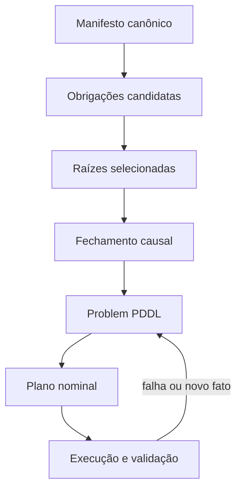

# Descrição do Domínio PDDL Acessília

**Versão:** 2.2 — domínio orientado a obrigações  
**Domínio:** `acessilia-obligations`  
**Granularidade:** uma instância `problem.pddl` por documento/requisição

## 1. Finalidade

O domínio orquestra o processamento de um documento a partir de obrigações produzidas por um compilador externo. Ele ordena obrigações, escolhe métodos admissíveis, evita métodos que já falharam e permite minimizar o custo total.

O PDDL não representa a estrutura completa do documento. Capítulos, seções, parágrafos, caixas de texto, cabeçalhos, rodapés, fórmulas, imagens, coordenadas, ordem de leitura e configurações de ferramentas permanecem em um **manifesto documental canônico**.

> O manifesto registra o que existe no documento; o compilador seleciona o que precisa ser tratado; o PDDL decide em que ordem e com qual método tratar cada obrigação selecionada.

## 2. Correções introduzidas na versão 2.2

A versão 2.2 corrige ambiguidades semânticas da versão 2.1:

1. `required` foi substituído por `selected`;
2. o compilador passou a calcular o fechamento transitivo das dependências;
3. apenas obrigações selecionadas são executáveis;
4. o critério de conclusão considera todo o conjunto selecionado;
5. `complete-job` também exige consistência causal do estado observado;
6. a validação de métodos cobre todo o fechamento causal selecionado;
7. cada problema deve declarar explicitamente `(:metric minimize (total-cost))`;
8. a semântica nominal de `execute-obligation` e o protocolo de confirmação externa foram explicitados.

Essas mudanças distinguem três conceitos que estavam misturados:

| Conceito | Significado na versão 2.2 |
|---|---|
| Obrigação candidata | Pendência conhecida pelo manifesto, ainda não necessariamente projetada no plano. |
| Raiz selecionada | Obrigação exigida pela política, pela requisição ou por uma saída solicitada. |
| Obrigação causalmente necessária | Predecessora transitiva de uma raiz selecionada; também recebe `(selected ?o)`. |

Uma obrigação realmente opcional permanece fora do conjunto `selected`. Se uma preferência do usuário, uma política ou uma dependência a tornar necessária, o compilador a promove para `selected`.

## 3. Arquitetura de integração

O fluxo recomendado contém quatro representações:

1. **Arquivo e requisição:** documento de entrada, formatos desejados e preferências.
2. **Manifesto canônico:** estrutura física, lógica e semântica, proveniência, confiança e estado observado.
3. **Projeção operacional:** raízes selecionadas, fechamento causal, métodos elegíveis, tentativas anteriores e custos.
4. **Problema PDDL:** objetos e fatos mínimos necessários para produzir o plano nominal.

O compilador deve ser determinístico. Um LLM pode auxiliar na interpretação de preferências ou na análise documental, mas não deve gerar diretamente a instância PDDL sem validação.



## 4. Limite entre manifesto e PDDL

### 4.1 Dados mantidos no manifesto/orquestrador

- documento, usuário, requisição e identificadores externos;
- árvore e grafo documental completos;
- alvo concreto de cada obrigação;
- texto, imagens, fórmulas, tabelas, código e coordenadas;
- formatos solicitados, verbosidade, idioma, política de OCR e privacidade;
- prompts, parâmetros, credenciais e handlers de ferramentas;
- obrigações candidatas ainda não selecionadas;
- resultados observados, escores, justificativas, auditoria e proveniência.

### 4.2 Dados projetados no PDDL

- obrigações relevantes para a instância;
- conjunto selecionado e fechado por dependências;
- tipo operacional de cada obrigação;
- pendência e satisfação observada;
- dependências operacionais;
- métodos disponíveis;
- suporte, admissibilidade e tentativas anteriores;
- custos inteiros não negativos.

O identificador PDDL de uma obrigação funciona como chave opaca para o manifesto. Por exemplo, `o-describe-figures-7` pode apontar externamente para um lote de figuras sem que esse lote seja representado como objeto PDDL.

## 5. Seleção e fechamento causal

O compilador começa com um conjunto de raízes:

```text
R = obrigações obrigatórias por política
  ∪ obrigações decorrentes das saídas solicitadas
  ∪ opções explicitamente escolhidas pelo usuário
```

Em seguida, calcula o menor conjunto `S` tal que:

```text
R ⊆ S

se o ∈ S e depends-on(o, p),
então p ∈ S
```

Todo elemento de `S` recebe:

```lisp
(selected <obrigação>)
```

Isso é o **fechamento transitivo de predecessoras**. O compilador, e não o planner, decide se um trabalho opcional foi promovido para o plano. O planner continua responsável por:

- encontrar uma ordenação válida;
- escolher o método de cada obrigação;
- minimizar o custo entre as alternativas admissíveis.

Obrigações candidatas não selecionadas podem permanecer apenas no manifesto. Se forem incluídas como objetos PDDL por razões de diagnóstico, não serão executáveis.

## 6. Requisitos e tipos

```lisp
(:requirements
  :adl
  :typing
  :derived-predicates
  :action-costs)

(:types
  obligation
  obligationkind
  method)
```

| Tipo | Papel |
|---|---|
| `obligation` | Pendência operacional concreta. |
| `obligationkind` | Categoria operacional da pendência. |
| `method` | Ferramenta ou estratégia capaz de tratar uma obrigação. |

`task`, `document` e `manifestref` continuam fora do domínio-base porque cada instância representa um único job e porque esses metadados não participam da busca.

## 7. Predicados

### 7.1 Ciclo de vida

| Predicado | Significado |
|---|---|
| `(queued)` | A requisição aguarda início. |
| `(processing)` | O job está em processamento. |
| `(completed)` | Todo o fechamento selecionado foi satisfeito em estado causalmente consistente. |

O compilador deve emitir exatamente um desses estados. Em uma instância inicial, normalmente emite `(queued)`; em replanejamento, normalmente emite `(processing)`.

### 7.2 Obrigações e dependências

| Predicado | Significado |
|---|---|
| `(kind-of ?o ?k)` | `?o` possui o tipo operacional `?k`. |
| `(selected ?o)` | `?o` pertence ao fechamento causal do plano atual. |
| `(pending ?o)` | `?o` ainda aguarda resultado válido. |
| `(satisfied ?o)` | O sucesso de `?o` foi observado e confirmado. |
| `(depends-on ?o ?pre)` | `?pre` precisa estar satisfeita antes de `?o`. |
| `(ready ?o)` | `?o` está selecionada, pendente e com todas as predecessoras satisfeitas. |
| `(all-selected-satisfied)` | Todas as obrigações selecionadas estão satisfeitas. |
| `(causally-consistent)` | Nenhuma obrigação satisfeita possui predecessora insatisfeita. |

Uma obrigação projetada deve estar em exatamente um dos estados `pending` ou `satisfied`.

### 7.3 Métodos

| Predicado | Significado |
|---|---|
| `(available ?m)` | O método está operacional. |
| `(supports ?m ?k)` | O método possui capacidade geral para o tipo. |
| `(admissible ?m ?o)` | O método respeita as restrições da obrigação concreta. |
| `(tried ?o ?m)` | O par já falhou ou teve seu resultado rejeitado. |

`supports` representa capacidade relativamente estável. `admissible` é calculado por requisição. Um serviço remoto pode suportar descrição de imagens e ainda ser inadmissível sob uma política `local-only`.

## 8. Predicados derivados

### 8.1 Prontidão

```lisp
(:derived (ready ?o - obligation)
  (and
    (selected ?o)
    (pending ?o)
    (forall (?pre - obligation)
      (or
        (not (depends-on ?o ?pre))
        (satisfied ?pre)))))
```

A inclusão de `(selected ?o)` impede a execução acidental de obrigações opcionais ou candidatas que estejam apenas listadas na instância.

### 8.2 Conclusão do conjunto selecionado

```lisp
(:derived (all-selected-satisfied)
  (forall (?o - obligation)
    (or
      (not (selected ?o))
      (satisfied ?o))))
```

O predicado não precisa distinguir raízes de predecessoras: ambas já pertencem ao fechamento `selected`.

### 8.3 Consistência causal

```lisp
(:derived (causally-consistent)
  (forall (?o ?pre - obligation)
    (or
      (not (depends-on ?o ?pre))
      (not (satisfied ?o))
      (satisfied ?pre))))
```

Esse predicado protege a conclusão contra estados incoerentes reconstruídos durante o replanejamento. Como a condição é verificada para toda obrigação satisfeita, também assegura consistência transitiva.

O compilador ainda deve rejeitar preventivamente um estado inconsistente; o predicado derivado é uma defesa adicional, não um substituto para validação.

## 9. Ações

### 9.1 `start-job`

Troca o estado global de `queued` para `processing`.

### 9.2 `execute-obligation`

Executa nominalmente uma obrigação que:

- pertence ao fechamento `selected`;
- está pendente;
- possui todas as predecessoras satisfeitas;
- tem tipo compatível com o método;
- usa um método disponível, admissível e ainda não tentado.

A seleção é incorporada por `ready`; portanto, não existe uma segunda ação para obrigações opcionais.

O efeito:

```lisp
(satisfied ?o)
(not (pending ?o))
```

representa **execução bem-sucedida e validada no modelo nominal**. O executor não deve aplicar esses efeitos cegamente ao estado persistente.

### 9.3 `complete-job`

Conclui o job somente quando:

```lisp
(all-selected-satisfied)
(causally-consistent)
```

O objetivo normal é:

```lisp
(:goal (completed))
```

Não é necessário acrescentar obrigações específicas ao objetivo. Se uma opção, como `o-summary`, foi escolhida, o compilador a inclui no conjunto `selected` e recalcula o fechamento causal.

## 10. Custos e métrica

```lisp
(:functions
  (execution-cost ?m - method ?o - obligation) - number
  (total-cost) - number)
```

O domínio apenas declara e acumula custos. A otimização só é solicitada pelo problema. Por isso, todo `problem.pddl` gerado para este perfil deve conter:

```lisp
(:metric minimize (total-cost))
```

Sem essa cláusula, o problema continua podendo ter planos válidos, mas não há garantia de escolha do método de menor custo.

Para compatibilidade com Fast Downward, os custos devem ser inteiros não negativos. O compilador pode combinar latência, custo monetário, risco, consumo computacional e exposição de dados em uma escala documentada.

Restrições duras não devem ser representadas apenas por custos altos. Elas devem excluir o par de `admissible`.

## 11. Compilação de preferências

Preferências não são copiadas passivamente para o PDDL; elas alteram raízes, admissibilidade, configuração externa ou custos.

| Entrada externa | Compilação |
|---|---|
| Saída HTML solicitada | Seleciona uma obrigação `export-html`. |
| Resumo opcional escolhido | Seleciona a obrigação `generate-summary`. |
| Descrição detalhada | Seleciona configuração externa e ajusta admissibilidade/custo. |
| OCR automático | Seleciona obrigação somente quando a inspeção indicar necessidade. |
| Execução somente local | Não emite pares admissíveis com métodos remotos. |
| Alta qualidade obrigatória | Seleciona validação adicional ou remove métodos insuficientes. |

Depois de selecionar as raízes, o compilador sempre recalcula o fechamento transitivo.

## 12. Exemplo de `problem.pddl`

O exemplo seleciona a exportação HTML e um resumo solicitado pelo usuário. `o-hierarchy` e `o-build` também são selecionadas porque pertencem ao fechamento causal.

```lisp
(define (problem acessilia-job-42)
  (:domain acessilia-obligations)

  (:objects
    o-hierarchy o-build o-validate o-export-html
    o-summary - obligation

    reconstruct-hierarchy build-canonical validate-accessibility
    export-html generate-summary - obligationkind

    docling hierarchy-llm canonical-builder accessibility-checker
    html-exporter local-summarizer - method)

  (:init
    (= (total-cost) 0)
    (queued)

    (kind-of o-hierarchy reconstruct-hierarchy)
    (kind-of o-build build-canonical)
    (kind-of o-validate validate-accessibility)
    (kind-of o-export-html export-html)
    (kind-of o-summary generate-summary)

    (selected o-hierarchy)
    (selected o-build)
    (selected o-validate)
    (selected o-export-html)
    (selected o-summary)

    (pending o-hierarchy)
    (pending o-build)
    (pending o-validate)
    (pending o-export-html)
    (pending o-summary)

    (depends-on o-build o-hierarchy)
    (depends-on o-validate o-build)
    (depends-on o-export-html o-validate)
    (depends-on o-summary o-build)

    (available docling)
    (available hierarchy-llm)
    (available canonical-builder)
    (available accessibility-checker)
    (available html-exporter)
    (available local-summarizer)

    (supports docling reconstruct-hierarchy)
    (supports hierarchy-llm reconstruct-hierarchy)
    (supports canonical-builder build-canonical)
    (supports accessibility-checker validate-accessibility)
    (supports html-exporter export-html)
    (supports local-summarizer generate-summary)

    (admissible docling o-hierarchy)
    (admissible hierarchy-llm o-hierarchy)
    (admissible canonical-builder o-build)
    (admissible accessibility-checker o-validate)
    (admissible html-exporter o-export-html)
    (admissible local-summarizer o-summary)

    (= (execution-cost docling o-hierarchy) 3)
    (= (execution-cost hierarchy-llm o-hierarchy) 7)
    (= (execution-cost canonical-builder o-build) 2)
    (= (execution-cost accessibility-checker o-validate) 2)
    (= (execution-cost html-exporter o-export-html) 1)
    (= (execution-cost local-summarizer o-summary) 2))

  (:goal (completed))

  (:metric minimize (total-cost)))
```

Se o resumo deixar de ser solicitado, `o-summary` não recebe `selected`. O compilador pode omiti-la inteiramente do problema.

## 13. Execução monitorada e replanejamento

O PDDL produz um plano nominal determinístico. Quando o plano propõe:

```lisp
(execute-obligation
  o-hierarchy
  reconstruct-hierarchy
  docling)
```

o runtime:

1. usa `o-hierarchy` para localizar alvo e configuração no manifesto;
2. chama o handler associado a `docling`;
3. valida o resultado observado;
4. em sucesso, confirma `satisfied` e remove `pending`;
5. em falha ou rejeição, não confirma o efeito, mantém `pending`, registra `(tried o-hierarchy docling)` e gera novo problema;
6. se surgirem novas obrigações ou dependências, atualiza o manifesto, refaz a seleção e o fechamento e replana.

Para o planner, `execute-obligation` é uma ação de sucesso determinístico. Para o executor, a chamada externa é uma tentativa cujo efeito só é confirmado após validação. Essa diferença é intencional e constitui um protocolo de **planejamento nominal com execução monitorada**.

O domínio não representa probabilidades, efeitos condicionais de falha nem criação dinâmica de objetos. Se tais propriedades precisarem ser raciocinadas dentro do planner, será necessário outro formalismo ou uma extensão do perfil.

## 14. Validações obrigatórias do compilador

Antes de emitir o problema, o compilador deve verificar:

### 14.1 Estrutura e estado

- identificadores PDDL únicos e sintaticamente válidos;
- exatamente um `kind-of` para cada obrigação projetada;
- ausência de ciclos e autoarestas em `depends-on`;
- fechamento causal: toda predecessora transitiva de uma obrigação `selected` também está `selected`;
- exatamente um entre `pending` e `satisfied` para cada obrigação projetada;
- toda obrigação `satisfied` possui todas as predecessoras transitivas satisfeitas;
- exatamente um estado de ciclo de vida entre `queued`, `processing` e `completed`;
- se `(completed)` estiver no estado inicial, todas as selecionadas estão satisfeitas e o estado é causalmente consistente.

### 14.2 Métodos e custos

Para cada obrigação `selected` e `pending`, deve existir ao menos um método `?m` que satisfaça simultaneamente:

```lisp
(available ?m)
(supports ?m <tipo-da-obrigação>)
(admissible ?m <obrigação>)
(not (tried <obrigação> ?m))
```

Além disso:

- todo par admissível que possa ser selecionado deve possuir custo inicializado;
- cada custo deve ser inteiro e não negativo;
- `(total-cost)` deve ser inicializado, normalmente com zero;
- um método já registrado em `tried` não pode ser a única alternativa restante.

### 14.3 Objetivo e integração

- o objetivo normal deve ser `(completed)`;
- o problema deve conter `(:metric minimize (total-cost))`;
- toda saída solicitada deve corresponder a uma raiz selecionada;
- toda obrigação PDDL deve possuir alvo e handler válidos no mapa externo;
- a configuração de busca deve suportar axiomas/predicados derivados.

Um problema que falhe nessas verificações deve ser rejeitado antes de chamar o planner, com diagnóstico voltado ao compilador ou ao runtime.

## 15. Compatibilidade com predicados derivados

Os predicados derivados foram mantidos. Fast Downward suporta axiomas e predicados derivados, embora nem todas as heurísticas sejam compatíveis.

Mover os `forall` para precondições não elimina necessariamente axiomas: o Fast Downward também compila condições universais em axiomas. A configuração deve usar componentes que declarem suporte a axiomas, como `ff`, `add` ou `blind`, conforme a versão utilizada.

Referências oficiais:

- [Fast Downward — PDDL support](https://www.fast-downward.org/latest/documentation/pddl-support/)
- [Fast Downward — Evaluator](https://www.fast-downward.org/latest/documentation/search/Evaluator/)

Se for obrigatório suportar um planner sem predicados derivados, deve-se criar e testar um perfil alternativo, por exemplo materializando `ready` externamente e replanejando passo a passo. Apenas copiar as quantificações para as ações não constitui uma solução portátil.

## 16. Invariantes e testes mínimos

Os testes automatizados devem demonstrar que:

- uma obrigação não selecionada não pode ser executada;
- toda predecessora de uma selecionada pertence ao conjunto selecionado;
- uma obrigação não fica pronta antes de suas predecessoras;
- o método de menor custo é escolhido entre alternativas legais;
- um par em `tried` não é reutilizado;
- `complete-job` não ocorre enquanto alguma selecionada está insatisfeita;
- `complete-job` não ocorre em estado causalmente inconsistente;
- ciclos são rejeitados pelo compilador;
- replanejamento preserva resultados confirmados e não confirma efeitos de tentativas falhas.

Também devem ser medidos:

- tempo de tradução;
- número de operadores aterrados;
- memória máxima;
- tempo de busca;
- custo e comprimento do plano;
- número de replanejamentos.

## 17. Quando reintroduzir elementos removidos

Reintroduzir `task`, `document` e relações de pertencimento somente se uma instância passar a conter vários documentos ou requisições concorrentes. Reintroduzir referências de manifesto apenas se decisões do planner dependerem de propriedades relacionais dos alvos.

Metadados úteis somente para auditoria, execução ou interface devem continuar fora do PDDL.

## 18. Síntese

A arquitetura da versão 2.2 é:

> **Manifesto canônico multicamada + seleção externa de raízes + fechamento causal determinístico + PDDL operacional mínimo + execução monitorada com confirmação e replanejamento.**

O PDDL não decide o conteúdo do documento nem inventa resultados perceptuais. Ele recebe um conjunto operacional coerente e decide a ordem e o método de tratamento, sob dependências, admissibilidade, tentativas anteriores e custo.
