# Dr.DocBench @ DocInsights 2026 — Plano de Execução

Data: 2026-09-15. **Deadline do paper: HOJE 23:59 UTC** (OpenReview, DocInsights Shared Task). Deadline EvalAI: 2026-10-10 12:59 UTC.

## 1. O desafio (resumo operacional)

| Item | Valor |
|---|---|
| Tarefa | 1 imagem de página → 1 Markdown estruturalmente fiel (texto no idioma original, tabelas HTML `<table>` c/ rowspan/colspan, fórmulas LaTeX `\( \)`/`\[ \]`, química `\ce{}`/SMILES, código fenced, música MusicXML; figuras ignoradas) |
| Unidade | **página única** (diferente do paper Dr.DocBench, que usa janela de 2 páginas) |
| Entrada | 509 páginas / 34 docs / 28 domínios BISAC — `data/evalai/drdocbench-evaluation-v4/images/<SUBJECT>/<uuid>/page_N.jpg` |
| Saída | `submission.zip` com `predictions.jsonl` (campos `subject, document_id, page, markdown`) **ou** árvore `<subject>/<uuid>/mds/<uuid>_<N>.md`. Validação estrita: sem faltas/extras/duplicatas |
| Métricas | Text Edit Distance (↓), Table TEDS (↑), Formula CDM (↑), Reading Order (↑); **Overall** = média por página dos componentes disponíveis (0–100) → ranking |
| Limites | 3 submissões/dia; até 2 selecionadas para avaliação final; top-teams devem entregar relatório técnico e declarar dados externos |
| Dev | HF `2077AIDataFoundation/DrDocBench` split `dev/` (986 pág., 66 docs, GT OmniDocJSON + mds) — disjunto do test |
| Referência | melhor sistema no paper: GPT-5.5 = 61.94 overall; MinerU 2.5 = 54.37; PaddleOCR = 34.78 |

## 2. A pipeline (PR A11yDevs/acessilia#97)

```
page.jpg → Toolbox capability document.structure.extract (--provider docling|mineru)
        → provider payload → build_canonical_document (árvore canônica Acessilia)
        → canonical_to_drbench_md → var/drbench/predictions/<uuid>_pN.drbench.md
        → build_submission.py → submission.zip (predictions.jsonl)
        → eval_run.py (métricas locais, dev) / validate_submission.py (formato)
```

Estado no PR: apenas 10 páginas de dev avaliadas (texto corrido), Docling 81.15 vs MinerU 77.84 overall; TEDS/CDM não exercitados. Métricas locais são aproximações (TEDS simplificado, CDM = F1 de tokens) — o avaliador oficial (`repos/DrDocBench`) deve ser a referência no paper.

Lacunas conhecidas que afetam score:
- `markdown_converter` emite fórmulas como `$$…$$` (desafio pede `\[ \]`) e listas só com `-`.
- `_extract_text_from_provider` achata elementos em texto plano antes do `build_canonical_document` → perde tipos (fórmulas, código, legendas) e pode alterar reading order.
- Nenhum tratamento de `\ce{}`, SMILES, MusicXML.
- `run_pipeline` é sequencial (1 página por vez) — 509 págs OK, mas dev completo (986) precisa de paralelismo.

## 2b. Arquitetura-alvo do sistema (visão do usuário)

```
                       page.jpg
                          │
            ┌─────────────┴─────────────┐
         Docling                      MinerU          ← generalistas: layout, OCR, reading order
            └──────────┬────────────────┘
              canonicalização (provider_payload_to_canonical)  → árvore A, árvore B
                       │
                  Tree Differ  (alinha blocos por bbox/texto; marca concordância/discordância)
                       │
               VisualAdjudicator  (VLM classificador restrito, só nos blocos ambíguos)
                       │   classes: plain_text · table · math_formula · chemical_formula/equation ·
                       │            chemical_structure · chemical_reaction · music_score · figure · code · unknown
     ┌─────────┬───────┼─────────┬───────────────┬──────────────┐
   text      TABLE    MATH     CHEM-eq        CHEM-struct     MUSIC
   (A/B)   MinerU     MinerU   VLM→mhchem    MolSight        homr
           TableFormer Docling  (\ce{})       MolScribe       Audiveris
           GraniteVis UniMERNet               DECIMER / RxnScribe·OpenChemIE (reação)
     └─────────┴───────┴─────────┴───────────────┴──────────────┘
                adjudicadores por domínio (TableAdjudicator≈TEDS, MathAdjudicator, ChemAdjudicator, MusicAdjudicator)
                       │
               árvore canônica final → canonical_to_drbench_md → <uuid>_pN.drbench.md
```

Princípio: generalistas localizam/classificam; VLM só roteia; especialistas produzem a linguagem formal do domínio (LaTeX/HTML/\ce{}/SMILES/MusicXML); adjudicadores resolvem discordâncias. Cada especialista é uma *capability* da Toolbox (`recognize-math`, `recognize-table`, `recognize-chemical-structure`, `recognize-music`), não um nome de ferramenta.

Estado atual (PR #97) = só a primeira camada (Docling **ou** MinerU, escolhido por flag), sem differ/adjudicador/especialistas. Para o paper de hoje: descrever a arquitetura completa como design, reportar resultados da camada 1 (dev subset) e, se der tempo, uma adjudicação simples por página (escolher provider por tipo de conteúdo).

## 3. Repositórios clonados

| Path | Branch | Papel |
|---|---|---|
| `repos/acessilia` | `feat/drbench-mineru-benchmark` | pipeline + métricas + build_submission |
| `repos/acessilia-toolbox` | `develop` | REST toolbox; providers docling/mineru/dataset-huggingface (main **não** tem MinerU) |
| `repos/DrDocBench` | main | avaliador oficial + `tools/model_infer/prompt_v3.txt` (prompt unificado) |
| `repos/OmniDocBench` | main (shallow) | deps do avaliador |
| `repos/drdocbench-challenge` | main | site oficial; `evaluator-specification.html` (contrato de scoring) |
| `paper/overleaf` | main | Overleaf via git (main.tex ainda é template vazio) |
| `data/evalai/drdocbench-evaluation-v4/` | — | 509 imagens, manifesto, validador, sample |

## 4. Ambiente do servidor — **REGRA 0: cluster DGX/Slurm**

Fonte obrigatória: [Orientacoes_cluster_dgx_SLURM.pdf](Orientacoes_cluster_dgx_SLURM.pdf) (texto: `Orientacoes_cluster_dgx_SLURM.txt`). Reler antes de qualquer execução.
- **Nenhum processo com GPU fora do Slurm** (nem python, uvicorn, docling-serve, mineru-api). Tudo por `sbatch`/`srun`. Violação pode bloquear a conta.
- Login node = `dgx-H100-02`, partição **`h100n2`**; `/raid` é local ao nó. Trabalho de CPU pesado também via Slurm (sem `--gres`).
- Estado em 2026-09-15 15:40 UTC: 8/8 GPUs alocadas na h100n2; fila FIFO por idade — nosso job `32553 partnr-smoke` (1 GPU, 4h) é o 1º da fila, seguido de 2 jobs de outro usuário. h100n3 tem 3/3 GPUs alocadas e fila. **Não há GPU imediata.**
- Caches em `/raid/user_marcospaulo/cache/*` (`HF_HOME`, `UV_CACHE_DIR`, `PIP_CACHE_DIR`, `TORCH_HOME`, `XDG_CACHE_HOME`); nada na home.
- Checkpoint: pipeline reentrante (pula páginas já geradas), `#SBATCH --signal=B:SIGUSR1@300`. Scripts em `runs/slurm/*.sbatch`, logs em `runs/slurm/logs/`, registro em `runs/slurm/JOBS.md`.
- Serviços (docling-serve :5001, mineru-api :5002, toolbox :8002) sobem **dentro** do job sbatch que roda a pipeline (mesmo nó/GPU).
- Disponível: `uv`, `tectonic`, python3.12, `module`. **Sem** docker (usar apptainer se precisar de container), conda, gh, pdflatex.
- `acessilia` exige Python `>=3.11,<3.12` → `uv venv --python 3.11`.
- Fallback sem GPU: **Docling em CPU** (job CPU-only, 32 cores) — viável para dev subset (~100 págs) e para as 509 de teste. MinerU em CPU é lento; usar só no subset.

## 5. Passo a passo

### Fase A — Infra (subagente `infra`) — bloqueia tudo — **tudo via Slurm**
0. `mkdir -p /raid/user_marcospaulo/cache/{huggingface,uv,pip,torch} runs/slurm/logs`; `runs/slurm/env.sh` exporta caches + URLs.
1. Job CPU `srun -p h100n2 -c 16 --mem 64G --time 01:00:00`: venvs — `repos/acessilia-toolbox/.venv` (`uv pip install -e ".[api]"`), `.venv-docling` (`docling-serve`), `.venv-mineru` (`mineru[core]`), `repos/acessilia/.venv` (py3.11, `-e .`); download de modelos Docling/MinerU para o HF cache em /raid; download `dev/**` do HF → `data/hf/dev`.
2. `runs/slurm/pipeline.sbatch` (parametrizado por PROVIDER, IMAGES_ROOT, OUT_DIR, DEVICE=gpu|cpu): sobe docling-serve/mineru-api + toolbox em background dentro do job, espera health, roda `run_pipeline.py` reentrante, trata SIGUSR1, encerra serviços.
3. Smoke: `sbatch --gres=gpu:1 --time=00:30:00 pipeline.sbatch` com `--sample 3` (ou CPU-only se a fila não liberar).

### Fase B — Inferência & submissão (subagente `inference`)
1. Rodar 509 páginas com `--provider docling` → `runs/evalai/docling/`; idem `mineru` → `runs/evalai/mineru/`.
2. `build_submission.py --predictions runs/evalai/<p> --out runs/evalai/<p>/submission`.
3. `python data/evalai/.../validate_submission.py submission.zip --manifest evaluation_pages.json` → deve retornar `valid` com 509 páginas.
4. Submeter no EvalAI (manual, pelo usuário; máx. 3/dia). Registrar score em `runs/SUBMISSIONS.md`.

### Fase C — Avaliação local em dev (subagente `eval`)
1. Rodar pipeline em subconjunto estratificado de dev (≥100 págs incluindo `table_*`, fórmulas, `double_column`, `fuzzy_scan`).
2. Avaliar com (a) `scripts/drbench/eval_run.py` (rápido) e (b) avaliador oficial `repos/DrDocBench` com `--num_pages 1` (instalar deps do OmniDocBench; CDM opcional se der tempo).
3. Produzir tabela por componente e por provider + drilldown das piores páginas → insumo para o paper e para melhorias.

### Fase D — Melhorias de pipeline (orquestrador decide após C; só se houver tempo antes do paper)
- Formato: `\[ \]` em vez de `$$`, preservar tipos de bloco (não achatar em texto), page_number/header fora do fluxo.
- Roteamento por página: escolher provider por características (tabela → MinerU/Docling conforme TEDS em dev).
- VLM fallback (Qwen-VL local em H100) para fórmulas/química usando `prompt_v3.txt`.

### Fase E — Paper (subagente `paper`) — **paralelo desde já**
1. Trocar template por ACL/EMNLP (`acl.sty`, `acl_natbib.bst` de acl-org/acl-style-files) em `paper/overleaf`; compilar com `tectonic`.
2. Estrutura long paper (8 pág.): Abstract · 1 Intro (Acessilia, motivação acessibilidade) · 2 Task & Data · 3 System (toolbox, providers, árvore canônica, conversor MD, submissão) · 4 Experimental Setup (dev subset, métricas locais vs oficiais) · 5 Results (Docling vs MinerU; por componente; EvalAI score se houver) · 6 Analysis/Error analysis · 7 Lessons learned · 8 Conclusion · Limitations · Ethics · Refs.
3. Commits pequenos e frequentes: `git -C paper/overleaf pull --rebase && git push` (Overleaf rejeita pushes grandes/binários grandes).
4. Placeholders `\todo{}` para números pendentes; congelar números às ~21:00 UTC; submissão no OpenReview até 23:59 UTC.

## 6. Orquestração

```mermaid
gantt
  dateFormat HH:mm
  axisFormat %H:%M
  section Infra
  A infra (venvs, serviços, smoke)      :a, 12:30, 2h
  section Pipeline
  B inferência 509 págs (docling+mineru) :b, after a, 2h
  C eval dev subset + avaliador oficial  :c, after a, 3h
  D melhorias (se couber)                :d, after c, 2h
  section Paper
  E1 template ACL + esqueleto            :e1, 12:30, 1h
  E2 escrita seções 1–4                  :e2, after e1, 3h
  E3 resultados + análise                :e3, after c, 2h
  E4 revisão, compile, OpenReview        :e4, 20:00, 3h
```



Regras do orquestrador (`main`):
- **Regra 0**: reler as orientações do cluster antes de rodar; GPU só via Slurm; registrar jobs em `runs/slurm/JOBS.md`.
- Um job Slurm por subagente de execução por vez; escolher GPU vs CPU-only conforme a fila (`squeue -p h100n2`, `sprio`).
- Toda métrica reportada no paper deve ter um arquivo de origem em `runs/` (JSON/CSV) — validar contagens antes de escrever.
- Números oficiais (EvalAI) prevalecem sobre métricas locais; explicitar no paper quando forem aproximações.
- Estado da sessão em `/memories/session/`; fatos do repo em `/memories/repo/drdocbench.md`.

## 7. Checklist de submissão

- [x] `validate_submission.py` → `valid`, 509 páginas (3 zips: mineru, adjudicator-v0, docling-forceocr)
- [x] EvalAI: MinerU enviado → Overall 58.09 (Text_ED 0.3235, TEDS 47.36, CDM 0.00, RO 53.44); adjudicator-v0 e docling-forceocr: anotar scores em `runs/SUBMISSIONS.md`
- [x] Paper: compila, conteúdo ≤ 8 págs, Limitations incluída; pushed no Overleaf (92d4f7f); submetido 2026-09-15
- [ ] Rotacionar o token Git do Overleaf

## 8. Pós-submissão (2026-09-16 →; EvalAI aberto até 2026-10-10 12:59 UTC, 3 envios/dia)

### 8.1 Estado consolidado (dev subset N=120, avaliador oficial sem CDM; fonte `runs/dev/*/reports/official.json`)
| run | score s/ CDM | text | RO | TEDS | formula 1−Edit |
|---|---|---|---|---|---|
| docling-forceocr | 64.9 | 78.7 | 76.5 | 0.0 | 0.0 |
| mineru | 72.1 | 73.1 | 76.8 | 58.2 | 69.3 |
| adjudicator-v0 (página) | **74.0** | 77.7 | 76.2 | 58.2 | 69.3 |
| differ-v1 (bloco, texto-only) | 72.8 | 76.5 | 74.6 | 58.2 | 69.7 |
| page-level oracle | 78.1 | | | | |

Gargalos conhecidos, em ordem de impacto esperado no score oficial:
1. **CDM = 0 no test** (fórmulas MinerU não creditadas) — peso 1/4 do Overall; causa não isolada.
2. **Adapter Docling descarta tabelas/fórmulas** (`_extract_text_from_provider` em `repos/acessilia/scripts/drbench/run_pipeline.py`) → TEDS 0; impede o Differ de ter dois candidatos de tabela.
3. Reading order 53.4 no test (76 no dev) — páginas multicoluna/`other_layout`.
4. Differ sem bbox perde ordem; árvores canônicas não persistidas.

### 8.2 Protocolo de avaliação (obrigatório para toda mudança)
Princípio: **uma mudança = um run nomeado = um número oficial no dev antes de qualquer envio ao EvalAI.**
1. **Conjuntos fixos** (não mexer): `dev-120` = `runs/dev/subset.json` (seed 13, estratificado) para iteração; `dev-986` = dev completo para confirmação antes de submeter; `test-509` só via EvalAI.
2. **Nomenclatura**: `runs/dev/<run-id>/` com `run-id = <componente>-<variante>-<yyyymmdd>` (ex. `mineru-cdmfix-20260917`, `differ-v2bbox-20260918`). Cada run guarda `predictions/`, `reports/{local,official}.json`, `run.log` e um `RUN.md` (o que mudou, commit dos repos, parâmetros, job id).
3. **Scorer primário**: avaliador oficial (`repos/DrDocBench/tools/multipage_pdf_validation.py`, janela 1 pág., `end2end_nocdm.yaml`). Scorer local só para regressão rápida (nunca para decidir).
4. **CDM local**: instalar TeX Live/`latexmk` + deps CDM no venv `repos/DrDocBench` (job CPU Slurm) para fechar o buraco do gargalo 1; até então, checar pelo menos que cada fórmula compila (`pdflatex -halt-on-error` em job CPU).
5. **Critério de aceite**: score s/ CDM no dev-120 ≥ baseline atual (74.0) − 0.3 **e** nenhum componente cai > 1.0 sem justificativa; confirmação em dev-986 antes de gastar 1 dos 3 envios/dia.
6. **Significância**: comparação pareada por página (`official_pages.json`): sign test / bootstrap 95% CI do delta (script a criar: `scripts/paired_compare.py <runA> <runB>`).
7. **Registro**: linha em `runs/dev/LEDGER.md` (run-id, baseline, delta, decisão) e, se enviado, `runs/SUBMISSIONS.md` (sha256 + score EvalAI).
8. Execução sempre via Slurm (REGRA 0); um sbatch genérico `runs/slurm/eval_run.sbatch RUN_ID` que faz build_official_pred → oficial → local → summaries.

### 8.3 Melhorias — ordem de execução
| # | Mudança | Como medir | Esperado |
|---|---|---|---|
| M1 | Diagnosticar CDM=0: baixar Stdout/Stderr da submissão EvalAI; compilar as fórmulas do `runs/evalai/mineru` com pdflatex; testar normalizações (`\begin{array}`, unicode, `\tag`, `$$` multilinha) | CDM local (8.2.4) + reenvio de 1 zip | Overall test +5–10 |
| M2 | Corrigir adapter Docling (tabelas TableFormer → HTML; fórmulas → `$$`) | TEDS/formula do run `docling-fix` no dev-120 | Docling s/ CDM 65→70+; melhora oracle |
| M3 | Persistir árvore canônica (JSON com bbox) ao lado de cada `.drbench.md` em `run_pipeline.py` | existência de `*.canonical.json` nos runs | habilita M4 |
| M4 | Differ v2 com bbox (λ>0, IoU) e ordem de leitura por geometria | `differ-v2bbox` vs v0 74.0 | > 74.0, aproximar 78.1 |
| M5 | Adjudicator v1 = v0 + regras de tabela/fórmula pós-M2 (dois candidatos de tabela → TEDS mútuo) | TEDS dev-120 | +2–4 TEDS |
| M6 | Rodar dev-986 para docling-fix, mineru, v1 (3 jobs CPU ~3,3 h cada, 2 em paralelo) | tabela completa | números representativos p/ camera-ready |
| M7 | GPU (quando a fila liberar): MinerU backend VLM, Docling com modelos GPU | mesmos runs | text/RO |

### 8.4 Organização do código
Hoje o código útil está espalhado: `scripts/` do workspace (differ, adjudicator, eval, builders), `scripts/toolbox_shim/` (monkeypatch MinerU), patch não commitado em `repos/acessilia-toolbox/.../providers/docling.py` (`force_ocr`), pipeline em `repos/acessilia/scripts/drbench/`. Plano:
1. **acessilia-toolbox** (fork `marcospaulo429`, upstream A11yDevs): commitar o `force_ocr` como opção de provider (`DOCLING_FORCE_OCR` env/param); mover o shim MinerU (`iterate_items`/`pages`) para dentro do provider MinerU; PR para `develop`.
2. **acessilia** (branch `feat/drbench-mineru-benchmark`, PR #97): criar pacote `scripts/drbench/` completo — `run_pipeline.py` (reentrante, `--item`, salva canonical JSON), `adjudicate.py` (v0/v0b), `tree_differ.py` (v1 texto; v2 bbox), `build_submission.py` (corrigir p0/subject via manifesto), `eval/` (local + wrapper do oficial + `paired_compare.py`), `slurm/` (sbatch genéricos). Mover os `scripts/*.py` do workspace para lá com testes mínimos (pytest sobre 3 páginas de dev). PR para `develop`.
3. **DrDocBench (upstream 2077AI)**: fork em `marcospaulo429/DrDocBench`; branch `feat/single-page-eval-cli` com o que tivemos de adaptar (`build_official_pred.py` → opção `--flat_pred_dir`, config `end2end_nocdm.yaml`, doc de instalação sem TeX). PR upstream só com o que for genérico; nada específico do Acessilia.
4. Workspace `drdocbench/` fica só com dados, `runs/`, `paper/` e `PLAN.md`; `scripts/` vira wrappers finos que chamam os pacotes dos repos.
5. Ordem: (1) → (2) → protocolo 8.2 funcionando → (3).
6. **Forks (feito 2026-09-16):** desenvolvimento só nos forks pessoais `marcospaulo429/{acessilia,acessilia-toolbox,DrDocBench}` (`origin`), `upstream` = A11yDevs / 2077AI. `develop` e `feat/drbench-mineru-benchmark` já publicadas no fork. Fluxo: branch `feat/*` → PR no fork (revisão interna) → PR fork→upstream. OmniDocBench (opendatalab) só se precisarmos alterar; drdocbench-challenge só leitura. Branches: acessilia `feat/drbench-adjudication` (PR novo; #97 fica como baseline), toolbox `feat/docling-force-ocr-mineru-shim`, DrDocBench `feat/single-page-eval-cli`.

### 8.5 Roadmap sequenciado (cada etapa termina com run nomeado + linha no LEDGER)
**Sprint 0 — infraestrutura de medição (pré-requisito de tudo)**
- S0.1 ✅ `runs/slurm/eval_run.sbatch RUN_ID` genérico (build_official_pred → oficial → local → summary); `runs/dev/LEDGER.md`; `scripts/paired_compare.py` (sign test + bootstrap por página). Validado: adjudicator-v0-notitle = 74.0 (job 32631).
- S0.2 ✅ CDM local funciona (2026-09-16): TeX Live + node + magick shim em `/raid/.../opt` (`runs/slurm/cdm_env.sh`). **Causa do CDM=0 local:** scikit-image 0.26 removeu `ransac(random_state=)`; a exceção era engolida por `except:` em `CDM.evaluate` → 0 silencioso. Fix: `scikit-image==0.22.0` no `repos/DrDocBench/.venv` (pin em `setup_cdm.sbatch`). Smoke: idênticas 1.0 / diferentes 0.667. Primeira avaliação dev com CDM: job 32646 (mineru-v3).
- S0.3 ✅ Branches publicadas no fork: acessilia `feat/drbench-adjudication` (d6d1348), toolbox `feat/docling-force-ocr-mineru-shim` (6be3685), DrDocBench `feat/cdm-env-robustness` (5425cf1: loga a exceção do CDM uma vez + nota de pin no README). **A partir de 2026-09-16 o agente só faz commit local; push é do usuário.**
- S0.4 ✅ `scripts/official_summary.py` lia `<run>_per_sample_CDM.json`; o avaliador grava `<run>_display_formula_per_sample_CDM.json` → `cdm`/`overall` ficavam `None` mesmo com CDM computado. Corrigido; `official.json` de todos os runs de hoje regerados (srun).

**Sprint 1 — recuperar o CDM (M1; maior alavanca, só test)**
- S1.0 ✅ **Causa-raiz encontrada (2026-09-16):** `backend/pipeline/structure_parser._looks_like_math_line` tipava prosa com math inline como bloco math → parágrafos inteiros virando `$$…$$` (falsas fórmulas, delimitadores desbalanceados, texto perdido). Fix em acessilia 98520df: `provider_payload_to_canonical` mapeia os elementos estruturados do manifesto (heading/paragraph/table→HTML/formula→`$$`) sem passar pelo parser heurístico. d9c57d4: parágrafo MinerU que é um único span `$…$` é promovido a fórmula display. Runs: `mineru-v2/v3-20260916` (replay offline dos `middle.json`, sem reinferência): text 73.1→73.9, fórmulas agora corretas (3 reais vs prosa), RO 76.8→72.9 **apenas** porque 4 páginas só-figura ficam vazias (antes o placeholder `# Dr.DocBench page` casava e dava RO=100) → resolvido no adjudicador (fallback Docling).
- S1.1 Baixar Stdout/Stderr da submissão MinerU no EvalAI; comparar formato das fórmulas com `sample_submission.zip`.
- S1.2 Compilar todas as fórmulas de `runs/evalai/mineru-v3-20260916` com xelatex em job CPU; classificar falhas.
- S1.3 🔄 CDM local dev-120 (config `end2end_full.yaml`, N=11 páginas com fórmula): mineru-v3 **76.2**, docling-v3 40.6, adjudicator-v1 76.2, differ-v2 **78.0** (overall com CDM 77.5). Envio EvalAI: differ-v2 test-509 (job 32653), não MinerU isolado (43/509 páginas vazias).

**Sprint 2 — Docling completo (M2 + M3)**
- S2.1 🔄 Adapter Docling: `docling-v2-20260916` (re-render dos manifestos do job 32632) = 63.9 (text 78.7, RO 73.8, **TEDS 0.0**, fórmula 21.8). Causa do TEDS 0: a toolbox nunca extraía `table_ast` de `TableItem.data` (chaves `table_cells`/`grid` não reconhecidas) → tabela sem texto → descartada. Fix toolbox e2f9ce6/6be3685 (`_table_ast_from_docling_cells`: usa `grid` denso, preserva células vazias, spans e `column_header`). Reinferência CPU: `docling-v3-20260916` dev (job 32644, 120/120) e test-509 (job 32645, 509/509, 8 s/pág). **Resultado dev-120: 68.6 (+4.7 vs v2; text 78.7, RO 73.8, TEDS 31.3, fórmula 21.8, CDM 40.6) — ACCEPT.** ✅
- S2.2 ✅ `run_pipeline.py --save-raw` persiste `<id>.provider.json` (manifesto) + `<id>.blocks.json` (tipo, texto, bbox, page_size) para Docling e MinerU; `scripts/rerender_from_payloads.py` + `runs/slurm/rerender_eval.sbatch` re-renderizam sem inferência. Limitação: o JSON bruto do docling-serve não é salvo → mudanças na toolbox exigem reinferência Docling.
- S2.3 Recalcular oracle por página e por bloco com docling-v3 + mineru-v3.

**Sprint 3 — adjudicação (M4 + M5)**
- S3.1 ✅ Adjudicator v1 (`scripts/adjudicate_v1.py`) sobre docling-v3 + mineru-v3: `adjudicator-v1-20260916` = **74.3** (+0.31 vs v0 74.0; text 78.7, RO 76.0, TEDS 58.2, fórmula 67.0) ACCEPT (job 32648). Variante `--table-pref docling --formula-pref docling` (`adjudicator-v1d`) = 72.0 (TEDS 43.9, fórmula 26.1) REJECT → MinerU segue melhor em tabelas/fórmulas mesmo após o fix Docling.
- S3.2 ✅ Differ v2 (`scripts/tree_differ_v2.py`, Hungarian em blocks.json, custo (1−λ)(1−sim)+λ(1−IoU), esqueleto de ordem MinerU, blocos só-Docling inseridos pelo centro mais próximo): `differ-v2-20260916` λ=0.5 τ=0.6 = **77.4** (+3.11 vs adjudicator-v1; text 80.8, RO 81.4, TEDS 58.2, fórmula 67.1, CDM 78.0; com CDM 77.5) ACCEPT (job 32650). Fica 0.7 abaixo do oracle por página (78.1) e acima em texto/RO. Grid λ∈{0.3,0.7}, τ∈{0.5,0.7}: job 32655 (`runs/slurm/differ_grid.sbatch`).
- S3.3 🔄 Test-509 com differ-v2 λ=0.5 τ=0.6: job 32653 → zip sha 34018a8a… → **EvalAI Overall 61.73** (Text_ED 0.2786, TEDS 57.51, CDM 0.0, RO 55.91; +3.64 vs MinerU 58.09). Grid λ/τ é plano (±0.1); `--min-len 0` (não descartar blocos Docling curtos) = **78.0** (+0.58, RO 82.3) → config final `--lam 0.5 --tau 0.6 --min-len 0`; test-509 job 32672 → próximo zip.
- S3.4 **Lição do EvalAI:** Overall ≈ média dos 3 componentes não-CDM (61.85 vs 61.73) → CDM quase não pesa no test (2/509 páginas com fórmula display na predição; subjects DRAMA/HEALTH/LAW…). **Sprint 1 (CDM) deixa de ser a maior alavanca; RO (55.9→60.8) e texto (72.1) são.**
- S3.5 ✅ **Protocolo oficial verificado na web (2026-09-16, aba Evaluation do EvalAI 2717 + evaluator-specification.html do site do desafio):** contrato `drdocbench-document-parsing-v3-single-page-md2md` — **unidade = 1 página** (a janela de 2 páginas do paper foi aposentada); **GT = Markdown curado `mds/<doc>_<page>.md`**, referência e predição passam pelo mesmo parser (`md_tex_filter`) e pelo `quick_match` → no repositório isso é `dataset/multipage_md2md_dataset.py`, **não** o `multipage_end2end_dataset` (JSON de layout) que usávamos localmente. Overall = média por página dos componentes disponíveis, depois média nas 487 páginas scoreáveis (22 não-scoreáveis). Texto scoreável: text blocks, títulos, código, referências; **excluídos: cabeçalhos, rodapés, números de página, figuras e legendas**; letras de grades de caça-palavras (GAMES) e o mapa denso de SPORTS p.14 excluídos. CDM só para `$$…$$`/`\[…\]`. Hipótese “janela de documento” **descartada**. O dev do HF tem `mds/` (1052 arquivos) → novo protocolo local: `runs/dev/eval-configs/md2md_{nocdm,full}.yaml` + `eval_full.sbatch PROTO=md2md WINDOWS=1`. **Resultado (job 32675, dev-986, 950 pág scoreáveis, `runs/dev-full/LEDGER.md` linhas `*-w1-md2md`):** differ-v2 evalai_style **66.4** (text 78.4, RO 58.3, TEDS 62.4) | mineru 62.5 (72.4/52.7/62.3) | docling 56.3 (76.0/53.8/39.1). Bate com o EvalAI do differ-v2 (63.15; text 71.7, RO 60.8, TEDS 57.5) — o gap de ~10 pontos era o protocolo end2end, não a janela. **md2md dev-986 = protocolo de aceitação oficial local a partir de agora.** RO (~58) é o componente mais fraco em todos os providers. CDM local falha silenciosamente em vários samples (`IndexError` em `[CDM] evaluation failed`) — irrelevante para o test.

**Sprint 4 — escala e backends (M6 + M7)**
- S4.1 🔄 dev-986: job GPU 32568 (`full_gpu.sbatch`, acessilia d6d1348 + toolbox 6be3685) concluiu `runs/dev-full/{docling,mineru}/predictions` (986 + 986, com blocks.json; docling force_ocr via providers-config.yaml) e reprocessou `runs/evalai/docling` (509, GPU). differ-v2 (min-len 0) dev-986 = job 32670. Avaliação end2end (job 32671, `runs/dev-full/LEDGER.md`): w1 differ-v2 82.1 (text 82.6, RO 84.4, TEDS 54.2) | mineru 72.1 | docling 74.0; wdoc (15 pág) RO cai (75.7/63.5/64.9) mas o protocolo oficial é 1 página, então wdoc é só diagnóstico. Pior assunto em RO: PSYCHOLOGY (RO 4.8, text 59; `fuzzy_scan`, página girada 90° — MinerU devolve lixo OCR, Docling lê mas o differ usa o esqueleto MinerU); COMICS text 32; SPORTS RO 60.
- S4.2 Quando houver GPU: MinerU backend VLM (`vlm-*`) e Docling com modelos GPU; runs `mineru-vlm-<data>`, `docling-gpu-<data>`; mesmo protocolo.
- S4.3 Reading order: analisar páginas com RO < 50 no dev (`official_pages.json`), testar ordenação por colunas no canonical → md.

**Sprint 5 — entrega**
- S5.1 PRs: toolbox → upstream `develop`; acessilia `feat/drbench-adjudication` → upstream `develop`; DrDocBench `feat/cdm-env-robustness` → 2077AI.
- S5.2 Melhor zip no EvalAI antes de 2026-10-10 12:59 UTC; `runs/SUBMISSIONS.md` completo.
- S5.3 Camera-ready do paper com números dev-986 + EvalAI finais (agente `paper`); rotacionar token Overleaf.

Regras transversais: REGRA 0 (Slurm) sempre; nunca gastar envio EvalAI sem número dev-986; nunca alterar dev-120/dev-986; toda mudança de código com commit referenciado no `RUN.md`.

## 9. Ciclo 2 (2026-09-18 →) — fechar o gap do leaderboard

### 9.1 Onde estamos (EvalAI Public Validation, 2026-09-18)
| | Text_ED↓ | TEDS↑ | CDM↑ | RO↑ | Overall |
|---|---|---|---|---|---|
| #1 AIKHEMIST | 0.181 | 57.6 | 0.24 | 74.5 | 74.3 |
| #2 OC | 0.194 | 69.4 | 0 | 69.1 | 71.3 |
| #3 Navidc-OCR | 0.185 | 70.9 | 0.44 | 64.3 | 70.0 |
| #6 DocTA | 0.253 | **75.0** | 1.85 | 62.5 | 66.2 |
| **nós (differ-v2-minlen0)** | 0.283 | 57.5 | 0 | 60.8 | **63.15** (≈ #7) |
Gap para o #1: texto −10 pts (71.7→82), RO −14 pts (60.8→74.5); TEDS já no nível do #1 (mas 17 abaixo do melhor). CDM é irrelevante no test (todos ≈0).

### 9.2 Diagnóstico dev-986 md2md (fonte: `runs/dev-full/DRILLDOWN_v3a_md2md.md`, `scripts/{drilldown_md2md,gt_md_inventory,gt_decor_order,unmatched_by_category}.py`)
1. **Convenção do GT curado (mds/):** cabeçalho, rodapé e número de página **estão no GT** (page_number 812/812, header 599/602, footer 155/158, legendas 375/401) e vêm **depois do corpo**, na ordem header → footer → page_number (781/812 números de página após o corpo). A spec do EvalAI diz "excluídos", mas o GT md2md não filtra categorias (`multipage_md2md_dataset.py` usa tudo que `md_tex_filter` extrai). Nós **descartamos** esses blocos (v3a) ou os emitimos no **topo** (v3e-junk) → nos dois casos perdemos.
2. **Custo medido:** o texto por página é a média (não ponderada) do edit por bloco; bloco GT não casado = edit 1. Em v3a, 2014/10914 blocos GT ficam sem par = **53% de toda a massa de erro de texto**; desses, page_number 417 + header 255 + footer 75 = **33% da massa total** (Docling detecta 99% deles, MinerU descarta 67–85%). Casos extremos: páginas só com tabela + número de página → text 0 (591d786d p10–22, 11fb213b p72/74). Efeito colateral: header ausente faz o `quick_match` casar o header do GT com um parágrafo errado → dupla penalidade.
3. **Oracle por página (max de v3a/mineru/docling):** 74.5 vs 68.2 (evalai_style); por componente: text 83.6 (v3a 77.7), RO 70.0 (60.3), TEDS 64.8 (62.4). O ensemble ainda deixa ~6 pts na mesa; RO é o componente com mais folga.
4. **Rotação:** 82 páginas `rotate270` → RO 43.8 (vs 61.9 normal); PSYCHOLOGY (15 pág, girada 90°) overall 31.5, RO 2.9; MinerU devolve lixo, Docling lê mas o esqueleto é MinerU. Nenhum provider corrige orientação da imagem.
5. **Layout:** three_column 61.8, other_layout 64.7 (174 pág), 1andmore_column RO 55.3; double_column é o melhor (74.5). Piores assuntos: PSYCHOLOGY 31.5, COMICS 34.8 (text 30.8; balões), GAMES 53.1, SPORTS 54.0 (2 páginas com 300+ rótulos de mapa; outlier), POETRY 54.9 (RO 40.8), SELF-HELP 58.8 (tabelas giradas/wireless).
6. **Tabelas:** TEDS 62.4 (n=68) = MinerU; Docling 39.1. Piores: tabelas wireless/giradas (591d786d, 11fb213b, STUDYAIDS 67587089) com TEDS < 10 nos dois providers → precisa de modelo melhor, não de voto.
7. **Blocos extras da predição** (sem GT): 107 em v3a (OCR de figura: "G日日80", "88888088", créditos) — cada um custa 1.

### 9.2b Mecânica do avaliador e taxonomia da perda (fase 2, 2026-09-18; `scripts/{text_loss_taxonomy,provider_block_compare,simulate_levers,simulate_text_policy,ro_decompose}.py`)
**Como o md2md pontua (verificado em `utils/match_quick.py`, `dataset/multipage_md2md_dataset.py`, `utils/extract.py`):**
- Blocos = split do md em `\n\n` (fallback `\n` se não houver parágrafo duplo). Tabelas HTML/md, `$$…$$` e code fences saem antes. Todo o resto é `text_block` (decorativos inclusos).
- Casamento Hungarian 1:1 sobre edit normalizado; custo > 0.7 → não casado. Text da página = 1 − ΣEdit/Σlen (**ponderado por comprimento**), depois média das páginas.
- `fuzzy_match_unmatched_items` perdoa **MERGES da predição** (pred contém várias linhas GT, ambos ≤ `_FUZZY_MAX_LEN=300`, dist < 0.4). `skip_truncated=True` → **SPLITS da predição nunca são fundidos**: um parágrafo GT quebrado em 2 custa ≈ o mesmo que apagá-lo (metade casa com edit ≈ 0.5, outra metade vira extra_pred com edit 1).
- RO = 1 − Levenshtein(posições GT ordenadas, posições GT na ordem da pred)/max; bloco GT sem par entra como deleção. Merge preserva a ordem GT → fundir parágrafos adjacentes não penaliza RO.
- Consequência: **sub-segmentação é quase grátis; sobre-segmentação custa como deleção.** Docling emite 12 496 blocos vs 11 417 do GT e 7 171 do MinerU; 120 páginas com razão pred/GT > 1.5; 75 páginas com blocos Docling sobrepostos/intercalados (198 pares); v3a herda 555 splits do Docling.

**Taxonomia da perda de texto (v3a, 22.3 pts perdidos, ponderado por comprimento):** split 7.25 · merge 4.05 · extra_pred 3.46 · corpo não casado 1.78 · OCR pesado 1.67 · par errado 1.25 · page_number 0.81 · OCR leve 0.80 · header 0.66 · footer 0.42.

**Escolha de texto (blocos de corpo casados nos dois):** MinerU melhor em 795, Docling em 516, empate 4223; erro ponderado MinerU 3.93% vs Docling 6.88%. `pick()` do differ escolhe **sempre Docling** → política errada para corpo; Docling só é insubstituível nos decorativos (só-Docling 1299 blocos, só-MinerU 442, nenhum 949).

**Decomposição do RO (v3a, 891 pág):** 60.6 (real) → 71.0 se todo GT casado (**−10.4 por blocos faltantes**) → 82.7 se além disso os decorativos forem ignorados (**−11.7 por decorativos deslocados**); os 17 restantes são ordem real (single_column 89, double 82.5, other 74, 1andmore 73, three 68). MinerU casado-só-corpo = 82.9 (mesmo teto). 15 páginas com ordem **invertida** (Spearman < −0.5), 12 delas `rotate270` do livro 6acfa608 (PSYCHOLOGY) → rotação de página, não esqueleto.

**Simulações (dev-986, evalai_style):** A (decor no fim) 68.2 → **71.9** (text 77.7→79.2, RO 60.3→66.8). Política de texto: v3a 77.7 · mineru_if_both 77.6 · docling_if_both 76.5 · **oracle por bloco 83.4** · v3a+A 79.2. Tabelas: descartar tabela ruim (TEDS<30, 13 casos) rende só +0.2 → não vale; 38/198 tabelas com estrutura < 0.5 (wireless/giradas) precisam de modelo.

### 9.3 Alavancas ordenadas por (ganho esperado ÷ custo)
| # | Mudança | GPU? | Ganho esperado (dev md2md) | Como medir |
|---|---|---|---|---|
| **A** | **Decorativos no fim da página, na ordem do GT** (header → footer → page_number) usando os `page_header/page_footer` do Docling + heurística de número de página (linha curta numérica/romana); excluir do casamento Hungarian; nunca no topo | não | text +4–6, RO +1–3 → **overall +2–3.5** | `differ-v4-decor` dev-986 md2md vs v3a 66.8; EvalAI 1 envio (teste decisivo: se o GT do test excluir decorativos, cai ~1) |
| **B** | Filtro de blocos-lixo: descartar blocos só-Docling com texto sem palavras (≥60% não-alfabéticos, CJK espúrio, `8888`), dentro de bbox de figura | não | +0.3–0.5 | idem |
| **C** | **Orientação de página**: detectar rotação (Tesseract OSD ou PaddleOCR `doc_ori` CPU; fallback: rodar Docling nas 4 rotações e escolher maior razão palavras-válidas) e girar a imagem antes dos dois providers | não | PSYCHOLOGY 31→~70; rotate270 RO 44→60 → **+0.7–1.2** | run `rot-<data>` (reinferência só das páginas giradas) |
| **D** | Esqueleto de ordem híbrido: quando MinerU tem < 50% dos blocos casados ou a página é `other_layout`, usar ordem geométrica (XY-cut por colunas sobre os bboxes fundidos) em vez do esqueleto MinerU; captions logo após a figura | não | RO +2–4 (oracle RO 70) | `differ-v4-xycut` |
| **E** | **Terceiro votante VLM** (MinerU2.5-Pro 1.2B via vLLM/`mineru-vl-utils`, ou PaddleOCR-VL-1.5): OmniDocBench v1.6 RO-edit 0.12 vs 0.153 do pipeline; TEDS 93 vs 82; text 0.036 vs 0.055. Usar como esqueleto de RO e candidato de tabela; Docling/MinerU-pipeline viram votantes | **sim (1×H100, ~2 h para 986+509 pág)** | text +3–5, RO +4–6, TEDS +5–10 → **+4–7** | `mineru-vlm-<data>` dev-120 → dev-986 → EvalAI |
| F | Consenso de tabela por TEDS mútuo (3 candidatos) + normalização HTML (sem `rowspan=1 colspan=1`, `<th>` na 1ª linha como o GT) | não | TEDS +1–3 | TEDS dev |
| G | Normalização de texto para o parser do GT: manter `*itálico*`/`**negrito**` quando o provider fornece; hifenização de fim de linha; não fundir palavras de rótulos de figura | não | text +0.5–1 | text dev |
| **H** | **Política de texto por bloco**: corpo casado nos dois → escolher pelo acordo (sim alta → MinerU; Docling só se o bloco MinerU for lixo/curto demais); Docling para decorativos e só-Docling; nunca emitir bloco Docling que se sobrepõe a outro bloco Docling já emitido | não | text +1–3 (oracle por bloco 83.4 vs 77.7) | `differ-v4-pick` |
| **I** | **Anti-split**: fundir blocos de texto adjacentes na mesma coluna quando o anterior não termina em pontuação final / o próximo começa em minúscula / gap vertical < 1.2× altura de linha; usar o bloco MinerU (maior) como unidade quando ele cobre ≥ 2 blocos Docling. Split custa 7.25 pts; merge indevido custa ~0 (fuzzy) | não | text +3–5, RO +0.5 | `differ-v4-merge` |
| **J** | Sem legenda/rótulo de figura fora do fluxo: legendas (Docling `caption`) logo após a figura; rótulos dentro de bbox de `picture` só se MinerU também os leu | não | extra_pred −1, RO +0.5 | idem |
Fila h100n2 em 2026-09-18: 8/8 GPUs alocadas, 5 jobs pendentes de outros usuários → A–D (CPU) primeiro; E entra em fila com `--time 04:00:00` e roda quando liberar.

### 9.4 Sequência e critérios
**Meta declarada pelo usuário: > 80 no EvalAI (líder atual 74.3).** Orçamento estimado (dev evalai_style, v3a = 66.8 local ≈ 63.15 EvalAI): A +3.7 → I +3–5 → H +1–3 → B/J +1 → C +0.7 → D +2 ⇒ **~77–79 local (~73–75 EvalAI) só com CPU**; E (VLM, GPU) é o que separa 75 de 80 (text 82→88, RO +5, TEDS +10). Sem GPU liberada hoje, 80 não é atingível hoje; ≥ 70 EvalAI hoje é.
1. **S6.1 (A+B+H+I+J em `tree_differ_v2.py`)** — flags `--decor-tail`, `--junk-filter`, `--text-pick auto`, `--merge-paragraphs`, `--caption-after-figure`. Variantes em dev-986 md2md (CPU sbatch `runs/slurm/differ_variants`, ~10 min cada): `v4-decor` (A) → `v4-decor-junk` (A+B) → `v4-pick` (A+B+H) → `v4-merge` (A+B+H+I) → `v4-full` (+J). Aceite por passo: cada flag ≥ +0.3 evalai_style sem text −0.3; alvo do conjunto: **evalai_style ≥ 72 e text ≥ 81**. Se aceito → test-509 → **EvalAI envio #1 do ciclo** (compara direto com 63.15; decide se o GT do test inclui decorativos).
2. **S6.2 (C)** — script `scripts/orient_pages.py` (CPU): classificar rotação das 986+509 páginas, gravar `runs/orientation.json`; reinferir Docling+MinerU só nas páginas giradas (CPU sbatch, ~80+? pág); run `differ-v4-rot`. Aceite: PSYCHOLOGY overall ≥ 60, nenhum outro assunto cai > 0.5.
3. **S6.3 (D)** — XY-cut/coluna no differ para páginas `other_layout`/baixa taxa de casamento; run `differ-v4-xycut`. Aceite: RO ≥ +1.5 sem text −0.3.
4. **S6.4 (E)** — sbatch `runs/slurm/mineru_vlm.sbatch` (`--gres=gpu:1 --time 04:00:00`): venv `.venv-mineru-vlm` (mineru[all] + vllm), backend `vlm-vllm-engine`, `--save-raw`, dev-120 primeiro (mede ganho isolado vs mineru-v3 70.7 e como esqueleto do differ), depois dev-986 + test-509. Só entra no differ se ≥ +2 em dev-120.
5. **S6.5 (F, G)** — após E, com 3 candidatos de tabela.
6. Cada envio EvalAI: linha em `runs/SUBMISSIONS.md`; máximo 1 envio/dia "exploratório" (A, depois E) para guardar os 2 selecionáveis finais.
7. **Paper/relatório técnico:** registrar as análises 9.2 (convenção de decorativos, custo de blocos não casados, oracle) como contribuição de análise do avaliador — é material inédito para o technical report exigido dos top teams.

**Status 2026-09-18 (fim do ciclo 2d, dev-986 md2md evalai_style):** S6.1 ✅ v4-merge 73.7 → S6.1b–g ✅ suppress-regions/pic-rule quality/fuse-lines/pick-guard/decor-wins 74.6 → S6.2 (C, rotação) ✅ v10-rot-best 75.5 (+0.9) → fuse-h-ratio 0.6 + fuse-max-len 300 ✅ 75.7 → running-heads 3 (corrigido) + pagenum-cap 4 ✅ **v12-rh3-pc4 75.9 (text 85.1, RO 79.3, TEDS 63.3)**. Zips válidos (509): `differ-v10-rot-best-20260918` (sha e5974a6b…) e **`differ-v12-rh3-pc4-20260918` (sha 3caf5bdd…) — enviar este**. Descartados: table-probe (neutro), table-full-page (neutro), lam 0.3 (= 0.5), tau/fallback (saturados). Pendentes: S6.3 (D, XY-cut — RO por layout: three_column 67, 1andmore 69), S6.4 (E, VLM — job 32750 PD, GPU 8/8), TEDS travado em 63.3 (oracle Docling/MinerU 66.4). Perda text residual 14.9 pts: pred_shorter 3.5, unmatched body 3.1 (f8438f43 boxing, 4cc5fd14 DK covers — só VLM), pred_longer 2.5, extra_pred 2.3.

### 9.5 Ciclo 3 — plano (após EvalAI 69.82 em 2026-09-18)
**Status 2026-09-18 15:40 — M1–M3 implementados em `scripts/tree_differ_v2.py` (`--flood-guard R`, `--pic-need-text`, `--formula-text`), avaliados em dev-986 +rot (job 32765, variants_v13.txt), base v12-rh3-pc4 75.9:** v13-fg 75.8 (text +0.1, RO −0.3; por página net negativo — os ticks Docling de páginas de gráficos casam com GT em dev → **M1 descartado** nesta forma), v13-pnt 75.9 (só 4 págs mudam, todas para cima: text +160 pts somados), v13-ft 75.9 (neutro; 11 fórmulas→texto), v13-all 75.9. **Zip final do dia (job 32766): `runs/evalai/differ-v13-pnt-ft-20260918/submission/submission.zip`, sha256 da91e889…, valid 509** = args v12 + `--pic-need-text --formula-text`; difere de v12 em 15 páginas do test (101 pic-suppress-skipped, 0 `$$` restantes; PETS 17945f2a p19 1→19 linhas, p23 3→11). Passos 1 (script formal), 4–8 pendentes. Robustez v12 vs v4-merge por doc (66 docs): mediana +0.34, 9 docs < −1 (591d786d −30.7 = rotação perde números de página; só 5 dev/2 test págs), 24 docs > +1.
**Leitura do resultado.** EvalAI (v12): text 74.6 · TEDS 58.1 · RO 71.2 · CDM 0.0 → Overall 69.82 (média por página dos componentes disponíveis). Ganho dev +9.5 virou +6.7 no test; gap dev→test cresceu de −3.3 para ≈ −6 (text −10.5, RO −8.1, TEDS −5.2). Não é mistura de assuntos (reponderar dev pela mistura do test dá text 87.5/RO 79.8 ≈ igual) → é variância por documento + overfitting das flags ao dev (34 docs de teste, 1–5 docs por assunto). Diagnóstico sem GT no test (`agree` = similaridade Docling×MinerU, `lexQ` = fração de tokens no léxico): 9 docs com agree < 0.45 — 2ca460ec LAW (índice de legislação, Docling 276 chars vs MinerU 1377), 4dddeac8 GAMES (caça-palavras, lexQ 0.31), 17945f2a PETS (rótulos em ilustração: MinerU só `picture`, Docling 6/17 rótulos e ainda suprimidos → saída = título + nº pág.), 3135ee8c TRAVEL (índice de ruas 6.5k chars/pág, lexQ 0.46), 5aa03c54 HEALTH (índice remissivo), bc7b5e32 NATURE (fichas escolares), 7da538b6 TECH (páginas de gráficos: Docling 90 blocos de ticks de eixo, MinerU 5 legendas corretas → saída 72 blocos), 9352143f STUDYAIDS, adf56403 JUVENILE. Páginas-conflito no test: MinerU ≤1 bloco & Docling ≥4 = 38 (7.5%); inundação Docling ≥5× MinerU & ≥30 blocos = 59 (11.6%, dev 6.1%).

**Ordem de execução (CPU primeiro, cada passo com aceite em dev-986 E em proxies do test sem GT):**
1. **Validação anti-overfitting (antes de qualquer flag nova).** Script `scripts/flag_robustness.py`: para cada flag de v4→v12, delta evalai_style por documento (68 docs); manter só flags com mediana ≥ 0 e ≤ 2 docs com queda > 1; reportar leave-one-doc-out. Proxies no test (sem GT) por variante: nº blocos/pág, chars/pág, lexQ, fração de blocos numéricos curtos, agree Docling×MinerU do resultado. Aceite de qualquer mudança futura: dev ≥ 0 **e** proxies do test não pioram.
2. **M1 — flood guard (páginas de gráficos/diagramas, 59 pág test).** Em `suppress_in_regions`/`unilateral`: quando Docling tem ≥ 5× blocos de MinerU e ≥ 30 blocos, descartar blocos Docling unilaterais curtos (< 15 chars) sem contraparte MinerU, exceto os com ≥ 2 tokens alfabéticos no léxico; tokens só-numéricos contam como qualidade 0 dentro de `picture` (hoje `lex_quality` de rótulo numérico é alta → mantém ticks de eixo). Conflito conhecido: cc4c4bb8 (clip numbers são GT) — resolver pela condição "MinerU tem ≥ 1 bloco texto na região" (cc4c4bb8 MinerU também lê os números; 7da538b6 não). Alvo: 7da538b6 72→≤ 10 blocos/pág; dev ≥ 75.9.
3. **M2 — MinerU vazio/picture-only (38 pág test, PETS 17945f2a 8 pág).** Se MinerU não tem bloco de texto na página, **não** aplicar `suppress-in-picture` a Docling (hoje `mineru_empty->docling` e mesmo assim suprime 4/6). Complemento CPU: reinferir só essas 38 (+69 dev) páginas com Docling `force_full_page_ocr=True` (ou MinerU `-m ocr` com layout desligado) como 3ª fonte ("ocr-full") e usar como fallback quando as duas fontes têm < 4 blocos de texto; sbatch CPU, ~2 min/pág. Alvo: PETS ≥ 12 blocos/pág.
4. **M3 — fórmulas espúrias (CDM já é 0).** 6 `$$` no test: `1 3 5 \times 6` (HEALTH, tabela de treino) e `\mathsf{CH}_3…` (química — spec exclui química do CDM, GT trata como texto). Regra: converter `$$…$$` para texto plano a menos que contenha operador matemático real (`\frac|\sum|\int|=|\sqrt|\lim|\partial`) **e** o doc tenha ≥ 3 fórmulas; não perde nada (CDM=0 hoje) e recupera text nas páginas afetadas.
5. **M4 — índices/listas (LAW 2ca460ec, HEALTH 5aa03c54, TRAVEL 3135ee8c = 45 pág, 9% do test).** GT = 1 bloco por coluna; MinerU sub-lê (772 chars num bloco que a imagem mostra ~1.9k). Onde Docling tem ≥ 3× mais linhas que MinerU na mesma coluna (x0 alinhado) e o texto MinerU é prefixo/subconjunto, preferir a coluna Docling fundida (`fuse-lines`) — extensão do `pick-guard` para "MinerU engoliu/perdeu coluna". Verificar em dev com 17b97659 (índice) e 761bb2e8.
6. **S6.3 (D) XY-cut** para `three_column`/`1andmore` (RO 67/69 vs 93 em coluna única; test é 2-col denso em LAW/LANGUAGEARTS). Aceite: RO dev +1.5, proxies estáveis.
7. **E (VLM, GPU)** continua sendo o único caminho para TEDS (58 → ~68) e text em páginas ilustradas (PETS, DK covers, comics): job 32750 PD. Se GPU não liberar, pedir ao usuário `scontrol hold` nos jobs flydet ou usar MinerU VLM em modo CPU/menor (`MinerU2.5-1.2B` via transformers, ~30 s/pág → só nas ~100 páginas-conflito do test). Só integra se ≥ +2 em dev-120.
8. **Envios EvalAI (máx. 3/dia; guardar 2 finais):** próximo envio só após M1+M2+M3 passarem no passo 1 (aceite duplo). Estimativa honesta: M1–M4 ≈ +1.5–2.5 Overall (→ ~72); D +0.5–1; E é o que leva a ≥ 75 (líder 74.3); 80 exige VLM forte em text+TEDS e não é garantido.

